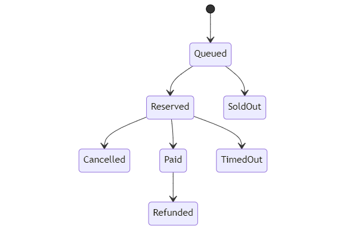

## Frontend assignment

## Welcome

Welcome to the assignment and thank you for taking the time. 
Over the next week you will not only show off your awesome technical skills but we will hopefully get to know each other. 
How we communicate about requirements, how we both ask and answer questions, and how we tackle uncertainty. 
Read the instructions, ask questions, show us what you can do, and have fun with it! 

You can find the test API here:

https://ts-ticketbeast-api.azurewebsites.net/swagger/index.html

## Assignment

This assignment is a single story for a fictitious company that handles ticket sales for concerts. 
You will be implementing a proof-of-concept against an API designed for this use-case.
The purpose is learning about what works, what edge-cases do we need to be aware of, and what changes we may need to make for this product to be successful. 

## Background
 
TicketBeast is currently an online ticket sales platform. Your team is building new kiosk software that is used to order a ticket for a concert at the entrance to a specific venue. The kiosk is used by a cashier at the venue to order on behalf of concert goers.
When ordering a ticket there is no guarantee that a ticket will be available as online orders and other kiosks are continually placing orders.
 
## Story
 
As a cashier
I want to order a ticket on behalf of a concert goer
So that they can pay for and receive the ticket on-premise at the venue
 
### Functional requirements
 
Implement a basic UI flow for the provided story. The main focus of the UI should be on efficient usability for our cashier with the intent to prove it is usable in conjunction with the online sales.
 
- Application needs to be responsive in providing feedback to the cashier
- Typically, cashiers are under heavy load just before a concert so processing payments quickly is important
- The only payment option that will be initially available is cash, so the cashier needs a way to mark a ticket as paid once it has been successfully reserved
- A ticket will be reserved for 5 minutes after which time the reservation will be cancelled (not in scope)
- No more than 2 tickets are allowed to be sold per concert goer
 
### Non-functional requirements
 
This is a proof-of-concept. Focus on the implementation of resilience, responsiveness, and user feedback. 
There is an OpenAPI spec as well as access to a test environment that implements the backend to manage the ticket reservation.
 
- It is important that the application is resilient to network flakiness. The test environment will simulate these network issues automatically.  
- The backend supports request processing by using client-generated ID’s.
- TypeScript is preferred over JavaScript.
- VueJS is preferable if you have experience building with it but not required.
- All design choices ( e.g.  testing, SPA or not, etc.) are all up to you, just be sure to be able to motivate your choices.

### Examples
 
Examples of scenarios that where discussed when scoping the proof-of-concept. These are captured here for information purposes and to highlight flows that are in scope and those that are out.
 
The one where...
 
#### In scope:
 
- there are seats available and customer pays cash
- there are NO seats available before trying to reserve
- there are NO seats available after trying to reserve

#### Out of scope:
 
- there are seats available and customer pays by card
- we need to cancel after a reservation request has been placed
- a reservation expires before a customer pays
- the backend becomes completely unresponsive
- Refunds
- cashier can pre-reserve tickets based on the queue length they observe at the kiosk
- login and auth

# Getting Started with Create React App

This project was bootstrapped with [Create React App](https://github.com/facebook/create-react-app).

## Available Scripts

In the project directory, you can run:

### `npm start`

Runs the app in the development mode.\
Open [http://localhost:3000](http://localhost:3000) to view it in the browser.

The page will reload if you make edits.\
You will also see any lint errors in the console.

### `npm test`

Launches the test runner in the interactive watch mode.\
See the section about [running tests](https://facebook.github.io/create-react-app/docs/running-tests) for more information.

### `npm run build`

Builds the app for production to the `build` folder.\
It correctly bundles React in production mode and optimizes the build for the best performance.

The build is minified and the filenames include the hashes.\
Your app is ready to be deployed!

See the section about [deployment](https://facebook.github.io/create-react-app/docs/deployment) for more information.

